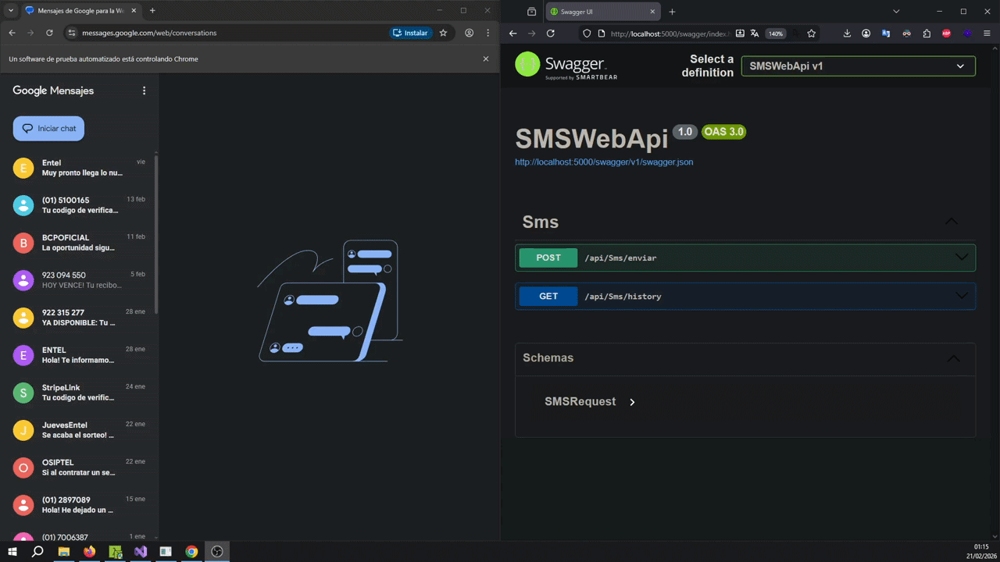
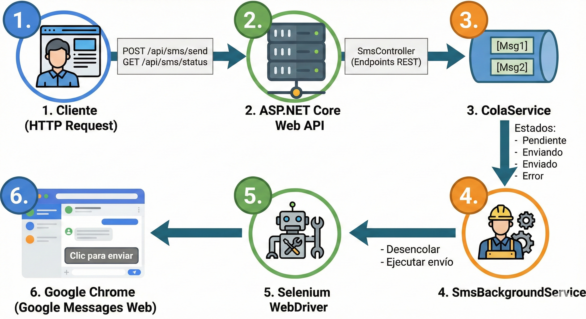
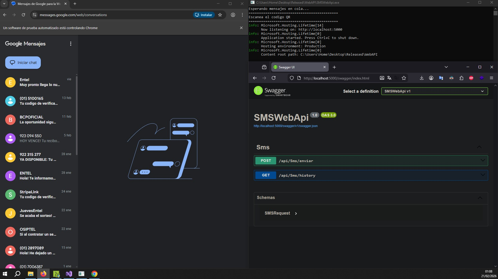

# Google Messages SMS API

[](LICENSE)
[](https://dotnet.microsoft.com/)
[]()

## Visión General

**Google Messages SMS API** es una solución de código abierto para envío de SMS mediante Google Messages Web. Diseñada para sistemas electorales, notificaciones de confirmación de voto, y aplicaciones que requieren envío confiable de mensajes SMS sin costos de APIs comerciales como Twilio.

## Video Demostrativo

<div align="center">
   
</div>

## Características Principales

- **API RESTful**: Endpoints HTTP para envío y seguimiento de mensajes
- **Cola de Mensajes**: Sistema de cola con procesamiento en background
- **Tracking Completo**: Seguimiento de estado de cada mensaje (Pendiente, Enviando, Enviado, Error)
- **Persistencia**: Historial completo de mensajes enviados para auditoría
- **Automatización con Selenium**: Control de Google Messages Web mediante ChromeDriver
- **Swagger UI**: Documentación interactiva de la API
- **Auditoría Electoral**: Trazabilidad completa para cumplimiento normativo

## Tecnologías Utilizadas

<div align="center">
  
  
  
  
  
  
</div>

## Arquitectura del Sistema

<div align="center">
  
</div>

## Guía de Instalación

### Requisitos Previos
- .NET 8.0 SDK o superior ([Descargar](https://dotnet.microsoft.com/download/dotnet/8.0))
- Google Chrome instalado
- Teléfono Android con Google Messages

### Pasos de Instalación

1. **Clonar el Repositorio**
   - Descargar o clonar este repositorio
```bash
   git clone https://github.com/ihackurass/Google-Messages-SMS-API.git
   cd Google-Messages-SMS-API

```

2. **Restaurar Dependencias**
   - Restaurar paquetes NuGet
```bash
   dotnet restore
```

3. **Compilar el Proyecto**
   - Compilar en modo Release
```bash
   dotnet build -c Release
```

4. **Ejecutar la Aplicación**
   - Iniciar la API
```bash
   dotnet run
```

5. **Configurar Google Messages (Primera Vez)**
   - La aplicación abrirá Chrome automáticamente
   - Escanear el código QR desde tu teléfono Android
   - La sesión quedará guardada permanentemente

6. **Acceder a la API (OPCIONAL TESTING)** 
   - Interfaz Swagger: http://localhost:5000/swagger
   - Endpoint base: http://localhost:5000/api/Sms

## Uso de la API

### Endpoints Disponibles

#### Enviar SMS
```http
POST /api/sms/enviar
Content-Type: application/json

{
  "telefono": "+51987654321",
  "mensaje": "Su voto ha sido registrado exitosamente"
}
```

#### Ver Historial de Envíos
```http
GET /api/sms/history?limite=50
```

## Estructura del Proyecto
```
SMSWebApi/
├── Controllers/
│   └── SMSController.cs           # Endpoints de la API
├── DTO/
│   └── SMSRequest.cs              # DTO para requests
├── Models/
│   └── SMS.cs                     # Modelo de mensaje
├── Services/
│   ├── ColaService.cs             # Gestión de la cola de mensajes
│   └── SMSBackgroundService.cs    # Worker que procesa la cola
├── Program.cs                     # Configuración principal de la aplicación
├── appsettings.json               # Configuración general
├── appsettings.Development.json   # Configuración para desarrollo
├── SMSWebApi.csproj               # Archivo de proyecto
└── readme.md                      # Documentación
```

## Capturas de Pantalla

<div align="center">
  
</div>

## Contacto

Si tienes preguntas o sugerencias, no dudes en contactarme :)

---

<div align="center">
  <sub>Desarrollado para sistemas electorales y notificaciones masivas confiables con un costo sumamente reducido 🗳️📱</sub>
</div>
